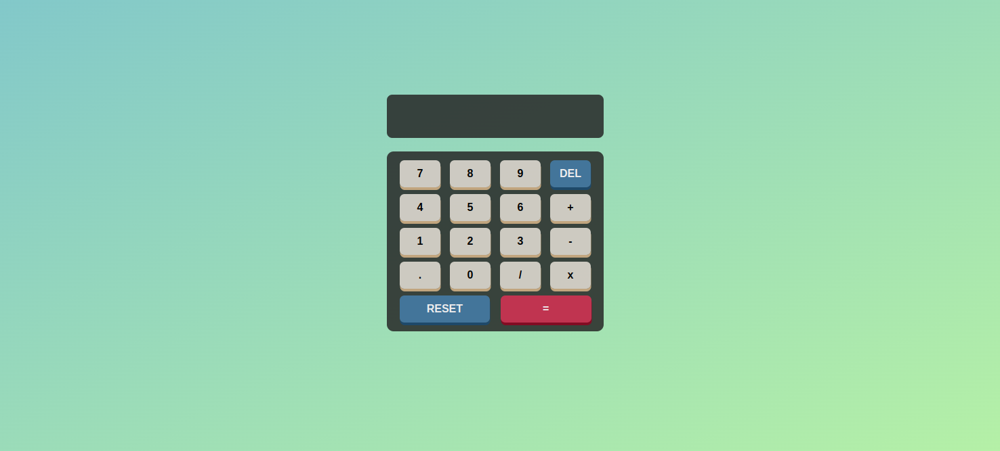

# HTML5, CSS, and JS Calculator

This is a simple calculator developed using HTML5, CSS, and JavaScript.

## Features

-   Addition, subtraction, multiplication, and division of numbers.
-   Clear button to clear the screen.
-   Decimal operations supported.

## Usage

Simply download the files from the repository and open them in your browser. The calculator will be displayed, and you can start performing mathematical operations.

## Contributions

If you want to contribute to this project, feel free to fork the repository, make your changes, and submit a pull request. It will be reviewed and considered for integration.

## License

This project is under the MIT license. You can see the LICENSE file for more information.

---

I hope you enjoy using this calculator. Thank you for your interest!

## Development Experience

Developing this calculator was a great learning experience for me. I had the opportunity to work with HTML5, CSS, and JavaScript to create a functional and user-friendly application. It allowed me to improve my skills in front-end development and understand the importance of user interface design. I'm excited to continue improving this project and exploring new ways to enhance its functionality.
